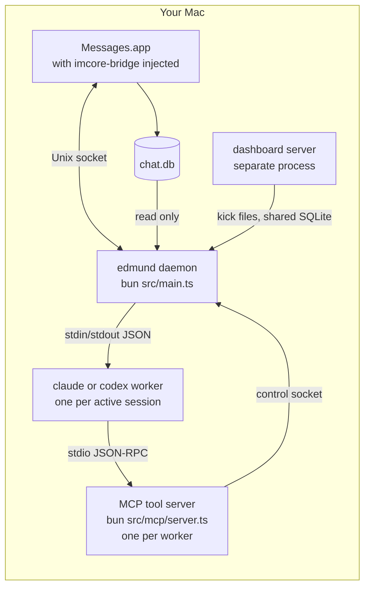
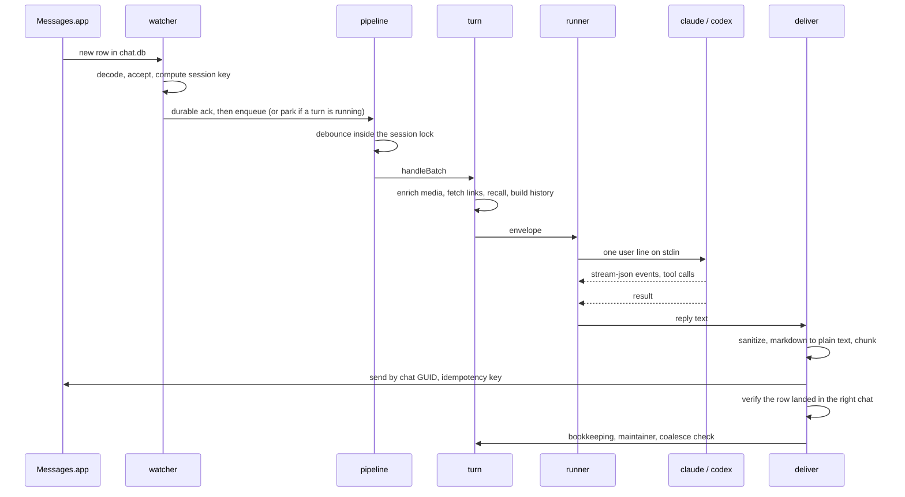

# Architecture

This page explains what runs, in what order, and how one message becomes one
reply. It is written from the code as of September 2026. Where the code and
this page disagree, the code is right; please open an issue.

## The processes

Four kinds of process are involved, and only one of them is yours to start.

- **The daemon** (`src/main.ts`) watches `chat.db`, runs the turn pipeline,
  owns every SQLite file under `data/`, and holds the only connection to the
  bridge inside Messages.app.
- **Messages.app** does the actual sending. The `imcore-bridge` dylib is
  injected into it and exposes IMCore operations over a Unix socket. If the
  injected side goes silent, the daemon's supervisor relaunches Messages.
- **Workers** are `claude` or `codex` CLI processes. With the warm pool on,
  one process stays resident per session and receives each turn as a single
  line on stdin. Without it, a process is spawned per turn and resumed by
  thread id.
- **The MCP server** is spawned by each worker. It registers the tools the
  model can call. Every Messages operation it performs goes back to the daemon
  over a control socket, so the daemon stays the single owner of the bridge.
- **The dashboard** runs as its own process and talks to the daemon through
  sentinel files it drops in `data/` and the SQLite files they share.

## Boot order

`main()` runs top to bottom. The order matters in a few places, and those are
the ones worth knowing.

1. Config is loaded and validated (`src/config/config.ts`). The integration
   registry is built from `[integrations]`.
2. A log sink tees every `console.*` call into `data/daemon.log`.
3. `chat.db` is opened read only, in WAL mode, with a prepared statement
   cache. Every reader in the process shares this one connection.
4. The bridge starts before anything that produces events, so events have
   somewhere to attach. The bridge control socket is served next.
5. `state.db`, `cron.db`, the address book and the contact aliases open.
6. Guest access, ghost preferences, the person maintainer, the skill curator,
   operator alerts and send verification are wired.
7. Recall (embeddings plus full text index) starts if enabled.
8. The session pipeline is constructed. SMS joins it if `[sms].enabled`.
9. The scheduler starts over `cron.db`. Integration runtimes start. Data
   triggers, refresh scripts and the reapers arm their timers.
10. **Catch-up runs before the watcher.** Orphaned inbound acks are replayed,
    then the whole `chat.db` backlog since the saved cursor is grouped per
    session and answered with one coalesced turn per chat. Only after the
    backlog drains does the cursor advance.
11. Recovery loops start strictly after catch-up, so they never race it.
12. The watcher starts. From here on, new rows in `chat.db` drive everything.

On `SIGTERM` or `SIGINT` the daemon stops timers, integrations, SMS, recovery
loops and recall, closes the bridge (Messages.app is left running), drains the
worker pool with a two second grace period, closes the databases and exits 0.

## One message, end to end

### Arrival

`startWatcher` (`src/imessage/watcher.ts`) polls `MAX(ROWID)` every 200 ms
and drains rows past the saved cursor. `fs.watch` on `chat.db` and events from
the bridge only wake the drain early. `chat.db` is the single source of truth
for inbound; nothing arrives any other way. A half written row (no chat join
yet, or an attachment file still shorter than its declared size) blocks the
line for up to 10 seconds, or 120 for attachments, rather than being skipped.

### Decode

`rowToMessage` builds an `InboundMessage`. When `text` is null the body is
read from `attributedBody`, which is an Apple typedstream: find the NSString
marker, read the length, take that many bytes, prefer the longest candidate
that is valid UTF-8. Attachments are resolved to absolute paths and carry
Apple's on-device transcript when there is one. Reply threading comes from
`associated_message_guid`. Tapbacks are not turns; reactions to the bot's own
messages are surfaced into the next envelope instead.

### Accept

`shouldAccept` (`src/channels/turn.ts`) drops the bot's own messages and
echoes, then `gateInbound` (`src/gating/allowlist.ts`) applies the allowlist.
DMs need to be on `allowlist.dm` (an empty list admits everyone) or arrive
through guest access. Groups need to be on `allowlist.groups` and mention one
of the configured names. Audio and video without a transcript pass through
for a second gate after transcription.

### Session key

`sessionKeyFor` (`src/sessions/key.ts`) maps a thread to a key such as
`imessage:dm:<handle>` or `imessage:group:<chat guid>`. Other namespaces are
`sms:`, `trading:`, `mirror:`, `agent:` and `orch:<name>:` for named
orchestrators. Handles are normalised: IMCore tags them with `e:` for email or
`p:` for phone, and that prefix once made the bot answer its own messages.

### Park or enqueue

Routing is recorded, then a durable inbound ack is written to `state.db`. The
ack is cleared only when a turn has covered the row, so a crash mid turn
replays the message instead of losing it. If the session already has a turn
in flight the message is parked in `data/pending/<hash>.jsonl`; a bare cancel
word aborts the in-flight turn. Otherwise it is enqueued.

### Debounce

`SessionPipeline` (`src/channels/pipeline.ts`) keeps one bucket per session.
Each new message resets an idle window (1.5 s by default, shorter for voice,
longer for a bare attachment) up to a hard cap. The flush happens inside the
session lock, so anything arriving while it waits joins the same batch.

### The turn

`handleBatch` resolves the guest tier, scaffolds the person or group file,
makes sure the session's sandbox directory exists, and drains any reply stuck
in the outbox before it thinks about calling the model. Enrichment runs in
parallel: copy received attachments into the sandbox, probe and transcribe
media, prefetch links, and run auto-recall. History is built from `chat.db`,
segmented at 30 minute gaps; DMs get history only on a cold start.
`buildEnvelope` (`src/channels/envelope.ts`) renders the framed block the
model sees: a header with venue, time and gap since the last message, the
participants, attachments and transcripts, history, recall blocks, reactions,
recent sandbox media, reply parents, fetched links, and finally the messages.

### The model

`runModel` (`src/model/runner.ts`) picks Codex for `gpt-*`, `o*` and `codex*`
model names and Claude Code for everything else. Switching provider drops the
provider thread id; the next turn is a cold start seeded from persona, recall
and history, so the visible conversation stays continuous.

`runClaude` (`src/claude/runner.ts`) builds the argv for headless Claude Code
(`-p`, stream-json in and out, bypass permissions, the MCP config, the model
and effort, and an appended system prompt). With `[claude.pool]` on, a
`WorkerPool` keeps one resident process per session, keyed by everything that
would otherwise force a respawn: sandbox, browser access, guest tier, model,
effort. A turn is one user line on stdin, read until a result event. Stream
events drive the typing indicator, liveness heartbeats, per-call context
measurement and tool logging. A failure is classified and handed to a healer
for exactly one retry.

### Tools

Each worker spawns `bun src/mcp/server.ts`. The server registers the tool
loadout for that session (see [tools.md](tools.md)) and performs every
Messages operation by calling back into the daemon over the control socket.
`protectStdout` redirects the console to stderr, because stdout is the
JSON-RPC stream and a stray log line would corrupt it.

### Delivery

`deliverReply` (`src/channels/deliver.ts`) sanitises the text (thinking
markers, role labels, the `KEEP_QUIET` sentinel), converts markdown to plain
text, and chunks at 1800 characters with code fences kept intact. Chunks go
out 400 ms apart. `sendMessage` addresses by chat GUID, never by service name,
and uses one idempotency key across up to four attempts.

After a send reports success, `verifyDelivery` polls `chat.db` for the message
GUID. If the row landed in one of the bot's own handles while it was meant for
someone else, that is a misdelivery. The bridge also refuses before sending
when the resolved chat is not the addressed one (`chat_mismatch`). Either
case gets two soft resends and then goes to the outbox so the model is not
called again on a wedged send. Permanent failures schedule an undelivered
notice instead.

### Bookkeeping

One row per model invocation goes into `spend.db` with the CLI's own cost
figure. The session row is updated, sent attribution recorded, retries
cancelled, and the ghost observer and person maintainer are notified. If
messages arrived mid turn, the turn re-runs with its draft up to three times
so the reply answers everything at once. Leftover pending messages are
re-enqueued and the inbound acks cleared. If the measured context crossed the
compaction threshold, a compaction is deferred until after delivery.

## Module map

| Directory | What lives there |
|---|---|
| `src/main.ts`, `src/boot/` | Boot order, recall wiring, catch-up, resource governor |
| `src/imessage/` | chat.db reader, watcher, decode, bridge host and control socket, send, verify, reactions |
| `src/gating/` | Allowlist, mention detection, guest admission |
| `src/sessions/` | Session keys, `state.db`, locks, contacts |
| `src/channels/` | Pipeline, turn, envelope, history, deliver, coalesce, barge-in |
| `src/claude/`, `src/codex/`, `src/model/` | Provider runners, worker pool, system prompt, persona loader |
| `src/mcp/` | The MCP server and every tool the model can call |
| `src/memory/` | Vector store, indexer, auto-recall, embedding providers |
| `src/persona/` | Person files, maintainer, consolidator, archiver, self memory |
| `src/ghost/`, `src/proactive/` | Proactive outreach: observer, budgets, fires |
| `src/cron/`, `src/triggers/`, `src/refresh/` | Scheduled, data-driven and deterministic wakeups |
| `src/recovery/` | Failure classification, healers, sweeper, outbox drainer |
| `src/spend/`, `src/credits/` | Spend ledger, per-person generation credits |
| `src/sms/` | Twilio channel on the shared pipeline |
| `src/guests/` | Campaign keys, vouching, caps |
| `src/agents/`, `src/research/` | Sub-agents, teams, deep research |
| `src/media/` | Transcription, video understanding, generation, resize and transcode |
| `src/skills/` | Skill discovery, consent, curation, announcements |
| `src/integrations/` | Registry, manifests, access control, optional exports |
| `src/alerts/`, `src/announce/`, `src/web/`, `src/util/` | Operator alerts, capability announcements, SSRF-guarded fetch, shared helpers |
| `cli/` | The `edmund` command |
| `dashboard/` | Operator dashboard and per-person portal |
| `integrations/`, `skills/`, `persona.example/` | Optional packages, the skill catalog, the persona template |

## How the processes talk

- **Bridge control socket** (`data/` path from `controlSocketPath`): the MCP
  server and other subprocesses invoke Messages operations through the daemon.
- **Kick files**: the dashboard drops `people-maintainer.kick`,
  `pool-flush.kick`, `recall-reindex.kick` or `recovery-sweep.kick` in `data/`
  and the daemon acts within a few seconds.
- **Status files**: `pool-stats.json` and `resource-status.json` are rewritten
  atomically every few seconds for the dashboard to read.
- **Shared SQLite**: the dashboard opens the same spend, state and cron files
  read side.
- **One-shot cron**: integrations, relays, agent completion, triggers and
  recovery all wake a session the same way, by inserting a cron row and poking
  the scheduler. There is no private route into a session.

## What is on disk

Everything the runtime writes lives in three ignored directories.

**`data/`**

| File | Purpose |
|---|---|
| `daemon.log` | Every process's log, one file |
| `state.db` | Sessions, cursor, acks, outbox, routing, guests, SMS, credits, ghost preferences |
| `cron.db` | Scheduled and one-shot jobs |
| `spend.db` | One row per model invocation, daily rollups, eval scores |
| `recall.sqlite` | Embeddings and the full text index |
| `agents.db`, `bg_jobs.db`, `triggers.db`, `refresh.db`, `alerts.db`, `announcements.db`, `annotations.db`, `errands.db`, `model_stats.db` | One subsystem each |
| `mcp*.json` | Generated MCP configs per session profile |
| `pending/<hash>.jsonl` | Messages parked behind an in-flight turn |
| `*.kick`, `pool-stats.json`, `resource-status.json` | Dashboard IPC |
| `dashboard.secret`, `portal-tunnel-url`, `sms-tunnel-url` | Runtime endpoints and secrets |

**`persona/`**: identity, venue rules, per-person and per-group memory,
archives, session transcripts. See [memory.md](memory.md).

**`sandbox/<slug>/`**: one directory per session, the worker's working
directory and its only writable tree. Received media, generated media,
proactive drafts, mission notes and sub-agent results live here.
